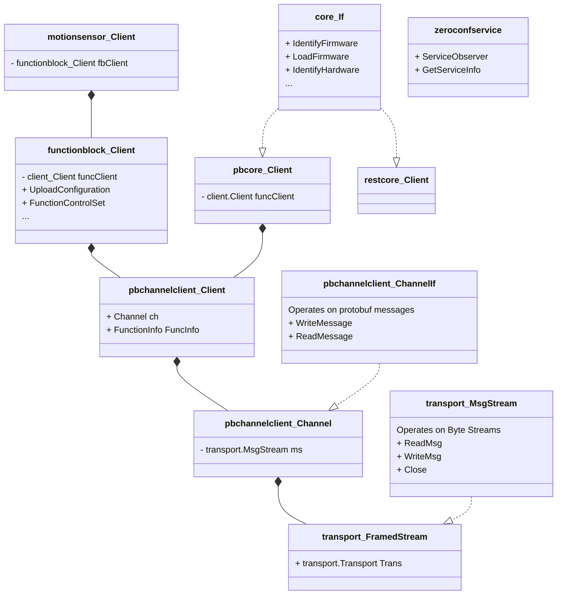

New structure

```
cmd/
pkg/
    protobufcom/
        common/
            channel
            functionblock
        core
        functionblockclients/
            analogintypea
            binaryiotypea
        tracelet
    restcom/
        core/
    zeroconfservice/
    core/
    transport
    server
```
